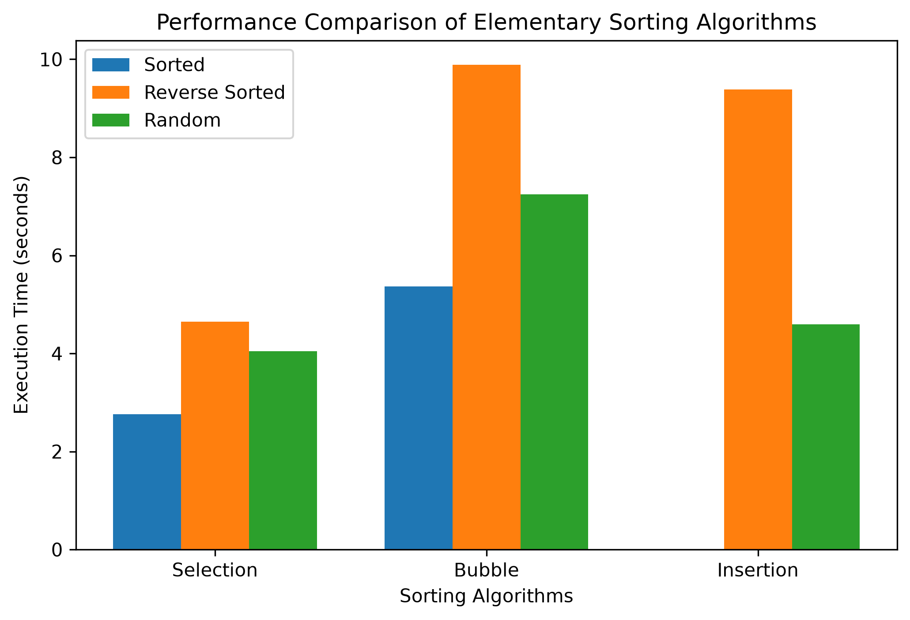

# Elementary Sorting Algorithms

A Python project that compares the performance of three elementary sorting algorithms: **Selection Sort**, **Bubble Sort**, and **Insertion Sort**. The algorithms are tested on sorted, reverse sorted, and random datasets containing 10,000 elements to analyze their execution time under different conditions.

---

## Features

- Implementation of Selection Sort
- Implementation of Bubble Sort
- Implementation of Insertion Sort
- Performance comparison on three datasets
- Execution time measurement
- Graphical visualization using Matplotlib

---

## Datasets

The algorithms are evaluated using the following datasets:

- **Sorted Dataset** – Numbers arranged in ascending order.
- **Reverse Sorted Dataset** – Numbers arranged in descending order.
- **Random Dataset** – Randomly shuffled numbers.

Each dataset contains **10,000** elements.

---

## Technologies Used

- Python
- NumPy
- Matplotlib
- Jupyter Notebook

---

## Performance Comparison

The graph below illustrates the execution time of each sorting algorithm on different datasets.



---

## Project Structure

```
Elementary-Sorting-Algorithms/
│
├── Elementarysortingalgorithms.ipynb
├── README.md
├── requirements.txt
├── .gitignore
└── images/
    └── comparison_chart.png
```

---

## How to Run

### 1. Clone the repository

```bash
git clone https://github.com/ishaarain03/Elementary-Sorting-Algorithms.git
```

### 2. Move into the project folder

```bash
cd Elementary-Sorting-Algorithms
```

### 3. Install the required libraries

```bash
pip install -r requirements.txt
```

### 4. Open the notebook

```bash
jupyter notebook Elementarysortingalgorithms.ipynb
```

Run all cells to reproduce the experiment and generate the performance comparison graph.

---

## Results

The experiment demonstrates how the execution time of elementary sorting algorithms changes with different input arrangements. The generated graph provides a clear comparison of their performance on sorted, reverse sorted, and random datasets.

---

## Future Improvements

- Compare additional sorting algorithms such as Merge Sort and Quick Sort.
- Test larger datasets.
- Measure memory consumption.
- Export experimental results to CSV.

---

## Author

**Isha Saleem**

BS Computer Science  
The Shaikh Ayaz University, Shikarpur

GitHub: **@ishaarain03**
